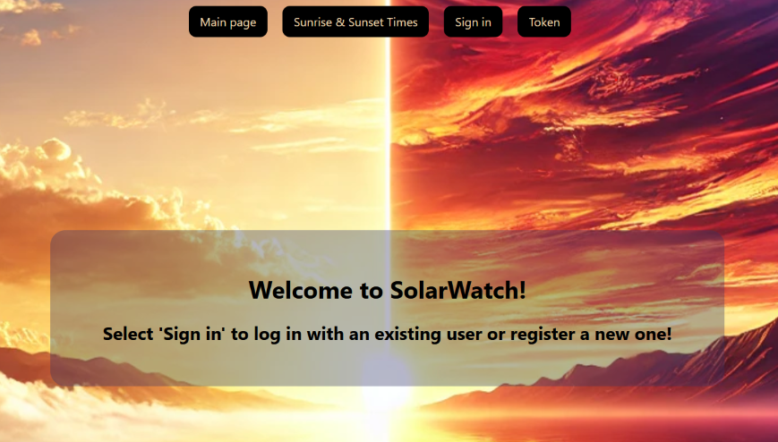
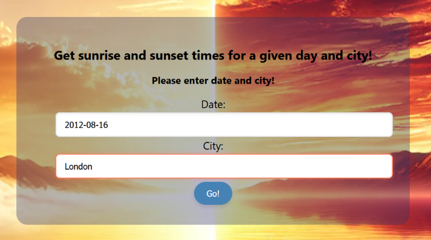
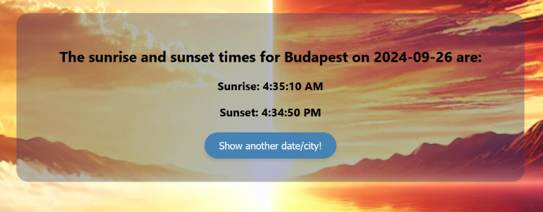

# SolarWatch - a SpringBoot/React demonstration web app


## What is SolarWatch?

SolarWatch is a webservice where users can query the sunrise and sunset time for a given city. 

It is a demo project, for practicing full-stack application development with SQL database, external API-s, user management, security etc.

## Built with
[](#) 
[](#) [](#)
[](#)
[](#)
[](#)

[](#)
  [](#)
[](#)
[](#)
[](#)




## Main features

- Getting the sunrise and sunset times on a given day and location using two external APIs
- Building database with the already fetched location data and sunrise/sunset times
- Security and role management
- Admin page for editing users
- Responsive design
- Database initialization
- Further admin pages to view or edit database content (TODO)
- Help function for selecting the proper location (TODO)
- Selectable UTC or local time (TODO)



## Developer
- [Levente Fülöp](https://github.com/fulopl)

## How to run this app?

### Prerequisites
Ensure the following are installed on your computer:
- Java Development Kit (JDK) 21 (https://www.oracle.com/java/technologies/downloads/#java21)
- Maven 3.9+ (https://maven.apache.org/download.cgi)
- Docker Desktop (https://www.docker.com/products/docker-desktop/)
- PostgreSQL (https://www.postgresql.org/download/)
- Node.js and npm (https://nodejs.org/en)

### Installation and run
To set up the project locally:
- Clone the github repo to your computer 
```sh
   git clone https://github.com/CodecoolGlobal/solar-watch-MVP-java-fulopl
   ```
- Open the project from IntelliJ IDEA
- Install backend dependencies if needed from the Maven menu
- Go to "client" folder and install frontend dependencies by entering "npm install" in the terminal
- Make sure Docker Desktop is running
- Run the app by entering "docker compose up --build" in the terminal

### Stopping the application
- Stop all the backend, frontend and database applications by pressing Ctrl+C in the terminal
- Remove the docker containers by entering "docker compose down" in the terminal

## How to use?
- You can sign in with one of the existing users by selecting the "Sign in" tab:
  - Choose username "user0" to "user4" or log in with the user with admin rights: "admin"
  - The password is always the same as the username (ie. "user0" for user0, "admin" for admin etc.)


- Or you can register a new user: 
  - Select the "Sign in" tab, and choosing "Register".
  - Then login with the username / password combination given by you in the previous step.


- Users can only use the "Sunrise & Sunset Times" feature after signing in.
Here you can give a city name and a date to get sunrise and sunset times.
By leaving the fields empty you will get the sunrise and sunset times for Budapest on the actual day in UTC time.




- With admin rights you can access the "Edit users" tab, where you are able to give roles to users or delete them.


