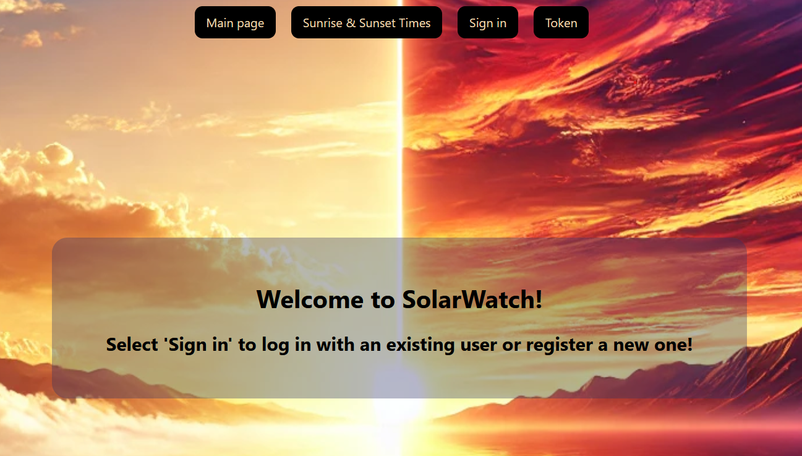

# SolarWatch - a website demonstration app

## What is SolarWatch?

SolarWatch is a simple Spring Boot web application created for practice and demonstration purposes.

## Main features

- Getting the sunrise and sunset times on a given day and location using two external APIs
- Building database with the already fetched location data and sunrise/sunset times
- Security and role management
- Admin page for editing users
- Responsive design
- Database initialization
- Further admin pages to view or edit database content (TODO)
- Help function for selecting the proper location (TODO)
- Selectable UTC or local time (TODO)

## Technologies
- Frontend: React (Create React App), Vanilla CSS
- Backend: Spring Boot with Spring Data JPA and Spring Security
- Database: PostgreSQL
- Docker Compose

## Developer
- [Levente Fülöp](https://github.com/fulopl)

## How to run this app?

### Prerequisites
Ensure the following are installed on your computer:
- Java 17
- Maven 3.9+
- Docker Desktop
- PostgreSQL
- Node.js and npm (for the frontend)

### Installation and run
To set up the project locally:
- Clone the github repo to your computer 
- Open the project from IntelliJ IDEA
- Install backend dependencies if needed from the Maven menu
- Install frontend dependencies by entering "npm install" in the terminal
- Make sure Docker Desktop is running
- Run the app by entering "docker compose up" in the terminal

### Stopping the application
- Stop all the backend, frontend and database applications by pressing Ctrl+C in the terminal
- Remove the docker containers by entering "docker compose down"

## How to use?
- You can sign in with one of the existing users by selecting the "Sign in" tab:
  - Use username "user0" to "user4" or,
  - the user with admin rights: "admin"
  - The password is always the same as the username (ie. "user0" for user0, "admin" for admin etc.)

- Or you can register a new user: selecting the "Sign in" tab, and choosing "Register".
- Then login with the username / password combination given by you in the previous step
- Users can only use "Sunrise & Sunset Times" feature after signing in.
- Here you can give a city name and a date to get sunrise and sunset times
- By leaving the fields empty you will get the sunrise and sunset times for Budapest on the actual day in UTC time

- With admin rights you can access the "Edit users" tab, where you are able to give roles to users or delete them.

