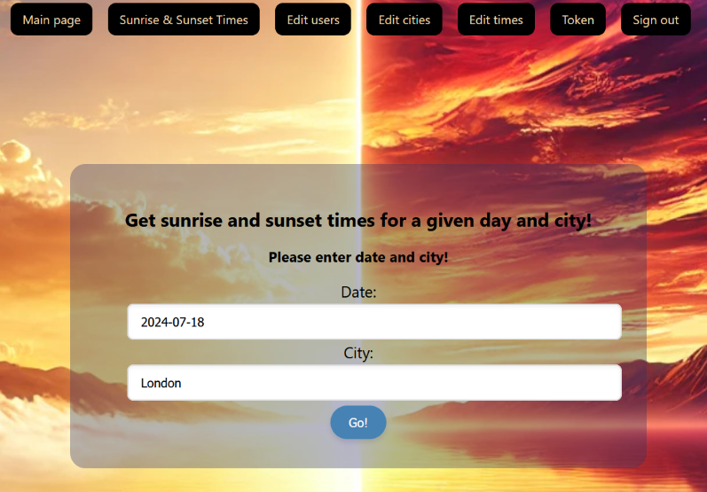

# SolarWatch - a SpringBoot/React demo app

<!-- TABLE OF CONTENTS -->
<details>
  <summary>Table of Contents</summary>
  <ul>
    <li><a href="#what-is-solarwatch">What is SolarWatch?</a></li>
    <li><a href="#built-with">Built With</a></li>
    <li><a href="#main-features">Main features</a></li>
    <li><a href="#developer">Developer</a></li>
    <li><a href="#how-to-run-this-app">How to run this app?</a></li>
    <ol>
        <li><a href="#prerequisites">Prerequisites</a></li>
        <li><a href="#installation-and-run">Installation and run</a></li>
        <li><a href="#stopping-the-application">Stopping the application</a></li>
    </ol>
    <li><a href="#how-to-use">How to use?</a></li>
  </ul>
</details>


## What is SolarWatch?

SolarWatch is a webservice where users can query the sunrise and sunset time for a given city.

It is a demo project, for practicing full-stack application development with SQL database, external API-s, user
management, security etc.

## Built with

[](#)
[](#)
[](#)
[](#)
[](#)
[](#)

[](#)
[](#)
[](#)
[](#)

<br />


## Main features

- Getting the sunrise and sunset times on a given day and location using two external APIs
- Building database with the already fetched location data and sunrise/sunset times
- Security and role management
- Admin pages for editing users, cities, time data
- Responsive design
- Database initialization with default users
- Selectable UTC or local time
- Helpful search function for selecting the proper location (TODO)



## Developer
- [Levente Fülöp](https://github.com/fulopl)

## How to run this app?

### Prerequisites
- Ensure the following are installed on your computer:
  - Git (https://git-scm.com/downloads)
  - Docker Desktop (https://www.docker.com/products/docker-desktop/)
- Create an account at https://home.openweathermap.org/users/sign_up to obtain your own API key. 

### Installation and run
To set up the project locally:
1. Clone the github repo to your computer by typing the following command in the command shell:
```sh
   git clone https://github.com/CodecoolGlobal/solar-watch-MVP-java-fulopl
   ```
2. Rename the ".env.example" file to ".env", and replace the placeholder variable values to your values:
  - replace the "your_secret_key" text with a randomly created, at least 32 characters long string
  - replace the "your_openweather_api_key" text with your previously obtained API key from https://home.openweathermap.org/api_keys .
3. Make sure Docker Desktop is running. 
4. Build the application containers and run the app by typing the command below (the build process may take some minutes):
```sh
   docker compose up
   ```

### Stopping the application
1. Stop the app by pressing Ctrl+C in the command shell
2. Remove the docker containers by entering "docker compose down" in the shell
```sh
   docker compose down
   ```

## How to use?
- You can use the app in a web browser at this URL: http://localhost:3000/
- You can use the "Sunrise & Sunset Times" feature after signing in.
- You can sign in with one of the existing users by selecting the "Sign in" tab:
    - Choose username "user0" to "user4" or log in with the user with admin rights: "admin"
    - The password is always the same as the username (ie. "user0" for user0, "admin" for admin etc.)


- You can also register a new user:
    - Select the "Sign in" tab, and choosing "Register".
    - Then login with the username / password combination given by you in the previous step.


- Users can only use the "Sunrise & Sunset Times" feature after signing in.
  Here you can give a city name and a date to get sunrise and sunset times.
  By leaving the fields empty you will get the sunrise and sunset times for Budapest on the actual day in UTC time.


- With admin rights you can access the "Edit users" tab, where you are able to give roles to users or delete them.


